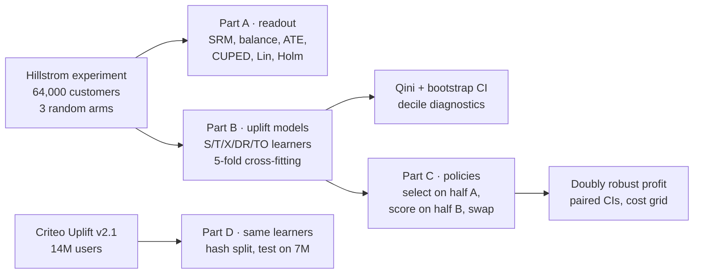

# uplift-targeting

Whom should a retailer e-mail, and with which e-mail, to earn money it would not have earned anyway? Uplift modelling and off-policy evaluation on two real randomised experiments (64,000 e-mailed customers, 14 million ad users), with model and budget selection held to the same out-of-sample standard as the models.

[](https://github.com/Pchambet/uplift-targeting/actions/workflows/ci.yml)

[](LICENSE)
[](https://pchambet.github.io/uplift-targeting/)


## TL;DR

- **Both e-mails work; the Mens e-mail works best.** It lifts conversion by +0.68 pp (95% CI [0.50, 0.86]) and spend by +$0.77 per customer, against +$0.42 for the Womens e-mail. Variance reduction buys almost nothing here: CUPED narrows the spend interval by 0.02%, a Lin regression adjustment the visit interval by 1.5%.
- **Heterogeneity is real for traffic and invisible for revenue.** 2 of 30 pre-declared segment tests survive a Holm correction, all on visits: the Womens e-mail barely moves menswear-only buyers. Uplift learners find that subset (DR-learner Qini ×1,000 2.7 [1.7, 3.6]), and in the response model's top 20%, 71% of e-mailed visitors would have come anyway against 58% for the uplift model. On spend, 0 of 22 rankings beat random.
- **The profitable decision is to e-mail everyone.** At a 40% margin and $0.15 per e-mail, the blanket Mens campaign earns $155 per 1,000 customers [$41, $269]. The best uplift procedure, which picks its model and budget on one half of the customers and is scored on the other, earns $114 while e-mailing 85%: a paired difference of -$41 [-$121, +$38]. Targeting only starts to pay from about 29 cents per e-mail.
- **An in-sample model contest would have said the opposite.** Choosing the best of 30 rankings and budgets on the evaluation data reports $182 per 1,000 (+$27 vs blanket). The candidates' merit barely replicates across random halves of the customers: rank correlation 0.24 on spend against 0.66 on visits.
- **A response model is a strong baseline, and the experiment says when it loses.** Paired on the same bootstrap draws, the Qini difference DR-learner minus response model (×1,000) is +0.7 [-0.2, +1.7] on Womens-e-mail visits, within noise, and -1.6 [-2.7, -0.6] on Mens-e-mail visits, where ranking by response wins. On 13,979,592 Criteo users the effect tracks the baseline rate, and the response model's top 20% holds 86% of all incremental conversions against 74% for the DR-learner (Qini ×1,000: 0.40 vs 0.28 for the DR-learner and 0.24 for the T-learner).

## Why it matters

A campaign team ranks customers and spends a contact budget on the top of the list. If the ranking predicts *who buys*, much of the budget goes to customers who would have bought anyway and to customers no e-mail will move. Uplift modelling ranks by *who buys because of the e-mail* instead. The catch is that individual effects are never observed, so every claim about them must come from the randomised design, out of sample, with its uncertainty. This project builds that chain end to end and lets the evidence decide between "target" and "e-mail everyone".

## Approach



1. **Readout (Part A).** Sample-ratio check, covariate balance, average effects with three estimators (difference in means, CUPED, Lin's interacted regression with HC2 errors), and 30 pre-declared heterogeneity tests with Holm and Benjamini-Hochberg corrections.
2. **Uplift models (Part B).** S-, T-, X-learners, a cross-fitted DR-learner and the transformed-outcome regression, each with LightGBM and a regularised linear base model, for both e-mails and three outcomes. All implemented in `src/uplift_targeting/learners.py`; no uplift library. Every customer is scored by models fitted without them (5 outer folds).
3. **Decision (Part C).** A policy ranks customers, picks the e-mail with the larger predicted effect, and e-mails the top share. Its value is estimated with inverse propensity weighting and the doubly robust (AIPW) estimator using the known 1/3 assignment probabilities. The model and the budget are chosen on one random half and scored on the other (cross-selection), so the reported value includes the cost of choosing.
4. **Scale check (Part D).** The same learners on the Criteo Uplift benchmark, read once from gzip CSV into Parquet with DuckDB, fitted on a hash-based sample of 2.3M users from one half and evaluated on all 6,990,739 users of the other.

## Results

**Where uplift models help, and where the response model is enough.** The Womens e-mail moves customers who buy womenswear and barely touches menswear-only buyers; every uplift learner finds that subset. The Mens e-mail's effect grows with how likely a customer is to visit anyway, so ranking by response does better there.


**Where a response model wastes contacts.** For the Womens e-mail, its top deciles are customers who visit anyway; the uplift model's top deciles are the ones the e-mail actually moves.


**Why the revenue decision cannot be targeted on this sample.** With 578 buyers, which ranking looks best for spend depends on which half of the customers you look at.


| Procedure (40% margin, $0.15 per e-mail) | Share e-mailed | Profit per 1,000 customers | 95% CI |
|---|---|---|---|
| E-mail everyone (Mens) | 100% | $155 | [$41, $269] |
| Uplift model, cross-selected model and budget | 85% | $114 | [$9, $219] |
| Response model, cross-selected budget | 92% | $142 | [$31, $254] |
| Best of 30 models and budgets chosen in-sample (optimistic) | 100% | $182 | not valid |

**When targeting pays.** Once an e-mail costs about as much as it returns, blanket sending loses money and both targeted procedures cut the list instead.


**At scale.** On the Criteo benchmark every ranking beats random by a wide margin. The effect grows with the baseline rate, so the response model ranks best on conversions and ties on visits; the meta-learners pay for estimating a small difference between two large, noisy predictions, and the DR-learner's final stage returns one constant score for 60% of users.


The interactive report re-prices every curve for any margin and cost: <https://pchambet.github.io/uplift-targeting/>.

## Reproduce

```bash
make setup    # uv sync --locked (Python 3.12)
make data     # Hillstrom (4 MB) + Criteo (311 MB), cached and SHA-256 checked
make run      # readout, models, evaluation, Criteo, figures
make report   # site/index.html
make test lint
```

`make run` took 34 minutes on a 10-core laptop shared with three other heavy jobs (Hillstrom cross-fitting 5 min, evaluation and bootstrap 6 min, Criteo 23 min); it caps itself at three cores and DuckDB at 3 GB of memory. Disk: about 0.6 GB under `data/` (gitignored). Tests run offline in under a minute on a 1,500-row fixture.

## Repository layout

```
src/uplift_targeting/
  data.py         download, checksum, pre-treatment feature encoding
  experiment.py   SRM, balance, Neyman / CUPED / Lin estimators, Holm, BH
  readout.py      Part A tables
  learners.py     S / T / X / DR / transformed-outcome meta-learners
  modeling.py     5-fold out-of-fold scoring of every model
  metrics.py      tie-aware Qini and uplift curves, weighted bootstrap
  policy.py       IPW and doubly robust policy values
  evaluation.py   Qini tables, deciles, cross-selected policies, cost grid
  criteo.py       Part D with DuckDB
  figures.py, report.py, narrative.py, report_template.html
results/          small CSV / JSON tables behind every number (committed)
docs/figures/     README figures
tests/            unit, synthetic ground truth, leakage and README-sync tests
```

## Methodology notes and limitations

- **No leakage by construction.** Features are pre-treatment only; outcomes live in a separate frame. A test scrambles the outcomes of held-out customers and checks that their scores do not change; another checks that the model chosen for one half never depends on that half's outcomes.
- **Estimators are validated on known truth.** On synthetic experiments, DR-, X- and T-learners recover the true effect ranking (Spearman > 0.75), IPW and DR policy values are unbiased over 300 replications (DR even with a deliberately wrong outcome model), and CUPED shrinks the variance by 1 - rho² as theory says.
- **What the intervals cover.** Qini intervals are a Poisson bootstrap over customers with scores fixed: they reflect evaluation noise, not retraining noise. Policy intervals are normal approximations on per-customer doubly robust scores; the default economics' cost term is deterministic and adds no variance.
- **Economics are assumptions.** The data has no margins or costs; 40% gross margin and $0.15 per e-mail (send cost plus fatigue and unsubscribe risk) are stated defaults in `config.py`. The cost figure and the report's sliders show how conclusions move.
- **One campaign, few buyers.** Hillstrom is a single two-week campaign from 2008 with 578 purchases; spend is heavy-tailed. "No targeting gain" means none detectable at this size, not that heterogeneity in spend does not exist.
- **Criteo is a scale check, not a replication.** Its features are anonymised, its labels are visits and conversions (no revenue), the treatment share is 85%, and the authors sub-sampled it non-uniformly. Models are fitted on a hash-based sample of one half (2.3M users) to fit the laptop budget; evaluation uses the full held-out half, with Qini intervals from 20 random groups instead of a bootstrap. The DR-learner's final stage returns one constant score for most users on conversions (0.3% base rate, 15% controls), which caps its ranking power; a multiplicative model (response × relative lift) was not tried and would likely close the gap. The file is ordered by treatment arm, so every ranking breaks ties at random, never by row order. Licence CC BY-NC-SA 4.0: downloaded for non-commercial use, never redistributed.

## References

- K. Hillstrom (2008). *The MineThatData E-Mail Analytics and Data Mining Challenge.* Data: `http://www.minethatdata.com/Kevin_Hillstrom_MineThatData_E-MailAnalytics_DataMiningChallenge_2008.03.20.csv` (public, not redistributed here).
- E. Diemert, A. Betlei, C. Renaudin, M.-R. Amini (2018). *A Large Scale Benchmark for Uplift Modeling.* AdKDD. Data: `huggingface.co/datasets/criteo/criteo-uplift`, CC BY-NC-SA 4.0.
- N. Radcliffe (2007). *Using control groups to target on predicted lift.* (Qini curve.)
- S. Künzel, J. Sekhon, P. Bickel, B. Yu (2019). *Metalearners for estimating heterogeneous treatment effects using machine learning.* PNAS.
- E. Kennedy (2023). *Towards optimal doubly robust estimation of heterogeneous causal effects.* EJS.
- S. Athey, G. Imbens (2016). *Recursive partitioning for heterogeneous causal effects.* PNAS. (Transformed outcome.)
- M. Dudík, J. Langford, L. Li (2011). *Doubly robust policy evaluation and learning.* ICML.
- S. Athey, S. Wager (2021). *Policy learning with observational data.* Econometrica.
- A. Deng, Y. Xu, R. Kohavi, T. Walker (2013). *Improving the sensitivity of online controlled experiments by utilizing pre-experiment data.* WSDM. (CUPED.)
- W. Lin (2013). *Agnostic notes on regression adjustments to experimental data.* Annals of Applied Statistics.
- S. Holm (1979). *A simple sequentially rejective multiple test procedure.* Scandinavian Journal of Statistics.

---

Built by [Pierre Chambet](https://github.com/Pchambet) — decision science for operations under uncertainty.
