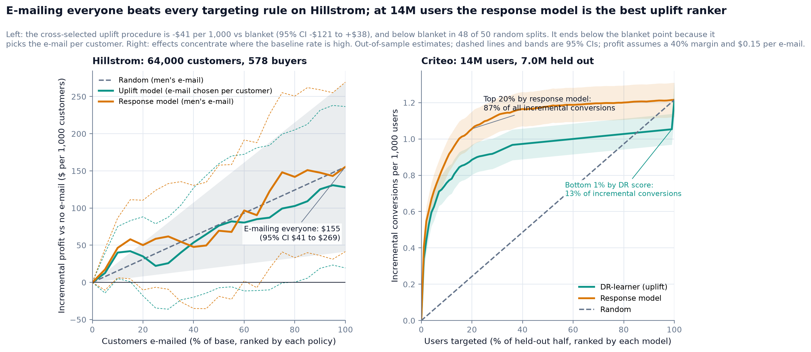
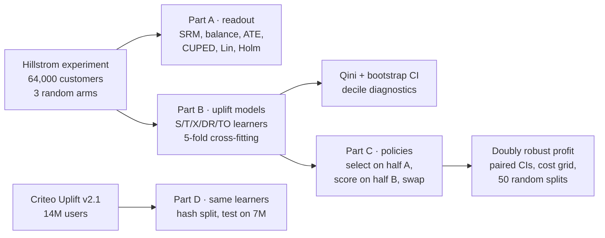
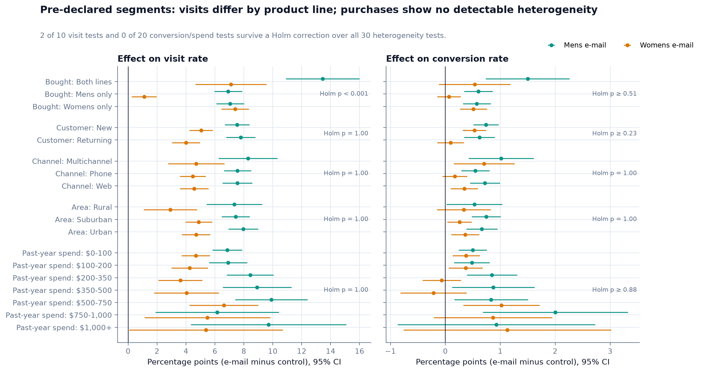
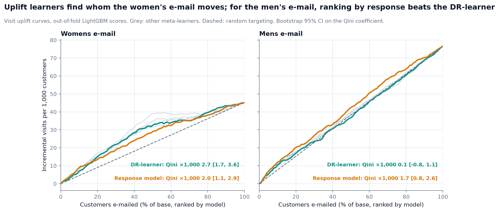
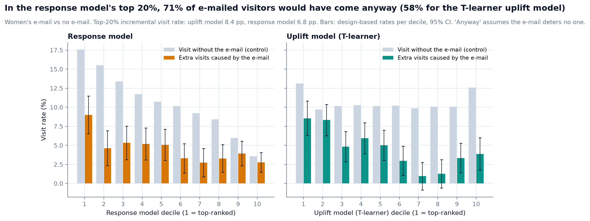
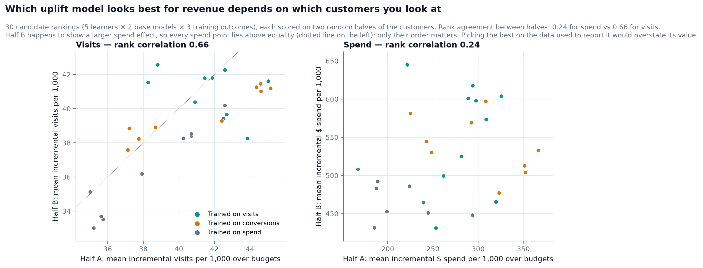
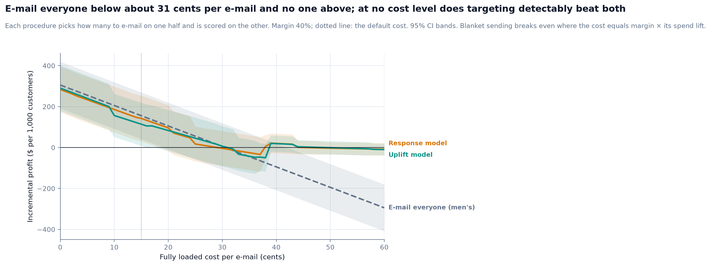
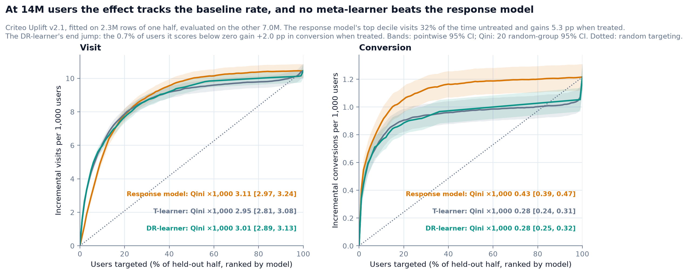

# uplift-targeting

Whom should a retailer e-mail to earn money it would not have earned anyway? On a 64,000-customer randomised test the honest answer is everyone, and a model contest scored on its own data would have promised more.

[](https://github.com/Pchambet/uplift-targeting/actions/workflows/ci.yml)

[](LICENSE)
[](https://pchambet.github.io/uplift-targeting/)



## TL;DR

- **Send the men's e-mail: it is the stronger of the two.** It adds +$0.77 of spend per customer against +$0.42 for the women's e-mail, and lifts conversion by +0.68 pp (95% CI [0.50, 0.86]).
- **Send it to everyone: no targeting rule beats that.** At a 40% margin and $0.15 per e-mail, blanket sending earns $155 per 1,000 customers against $115 on average for the best uplift procedure, which is chosen on one half of the customers, scored on the other, and falls short of blanket in 48 of 50 random half-splits.
- **An in-sample model contest would have promised a gain.** Scored on its own data, the best of 31 rankings and budgets recommends personalising which e-mail each customer gets and reports +$27 per 1,000 over blanket; chosen out of sample, the same idea is -$27.
- **Heterogeneity is real for visits and invisible for revenue.** 2 of 30 pre-declared segment tests survive a Holm correction, all on visits; on spend, 0 of 22 rankings (11 per e-mail) beat random targeting.
- **A response model is a strong baseline, and at 14 million users it wins.** On the Criteo benchmark the effect tracks the baseline rate, so the response model's top 20% holds 87% of all incremental conversions, against 73% for the DR-learner.

## Why it matters

A campaign team ranks customers and spends a contact budget on the top of the list. If the ranking predicts *who buys*, much of the budget goes to customers who would have bought anyway and to customers no e-mail will move. Uplift modelling ranks by *who buys because of the e-mail* instead. The catch is that individual effects are never observed, so every claim about them must come from the randomised design, out of sample, with its uncertainty. This project builds that chain end to end and lets the evidence decide between "target" and "e-mail everyone".

## Approach



1. **Readout (Part A).** Sample-ratio check, covariate balance, average effects with three estimators (difference in means, CUPED, Lin's interacted regression with HC2 errors), and 30 pre-declared heterogeneity tests with Holm and Benjamini-Hochberg corrections.
2. **Uplift models (Part B).** S-, T-, X-learners, a cross-fitted DR-learner and the transformed-outcome regression, each with LightGBM and a regularised linear base model, for both e-mails and three outcomes. All implemented in `src/uplift_targeting/learners.py`; no uplift library. Every customer is scored by models fitted without them (5 outer folds).
3. **Decision (Part C).** A policy ranks customers, picks the e-mail with the larger predicted effect, and e-mails the top share. Its value is estimated with inverse propensity weighting and the doubly robust (AIPW) estimator using the known 1/3 assignment probabilities. The model and the budget are chosen on one random half and scored on the other (cross-selection), so the reported value includes the cost of choosing; the whole procedure is repeated over 50 random splits.
4. **Scale check (Part D).** The same learners on the Criteo Uplift benchmark, read once from gzip CSV into Parquet with DuckDB, fitted on a 2.3M-user sample of one half (chosen by a hash of the features) and evaluated on all 6,994,996 users of the other.

## Results

**Part A: the randomisation holds, and only product line changes the effect.** 2 of 30 Holm-corrected segment tests survive: the men's e-mail lifts the visit rate by +13.4 pp among buyers of both lines, against +6.9 pp to +7.1 pp for the other product-line groups; the women's e-mail lifts the visit rate by +1.1 pp among menswear-only buyers, against +7.1 pp to +7.4 pp for the other product-line groups. Variance reduction buys little: CUPED on past-year spend narrows the spend interval by 0.02%, Lin's adjustment the visit interval by 1.5%.



**Part B: uplift learners find the women's e-mail's subset, but so does the response model.** On visits, the DR-learner's Qini ×1,000 is 2.7 [1.7, 3.6] for the women's e-mail against 2.0 [1.1, 2.9] for the response model: paired on the same bootstrap draws it does not detectably beat it (+0.7 [-0.2, +1.7]), and 9 of 10 uplift learners score above it on point estimate. For the men's e-mail, whose effect grows with how likely a customer is to visit anyway, the DR-learner loses to the response model (-1.6 [-2.7, -0.6]) and only 1 of 10 uplift learners score above it. On spend, all 11 Qini point estimates for the men's e-mail are negative.



**Where a response model wastes contacts.** For the women's e-mail, the response model's top 20% is full of customers who visit anyway: 71% of its e-mailed visitors would have come without the e-mail, against 58% for the T-learner's top 20% (reading the control rate this way assumes the e-mail deters no one).



**Part C: the revenue decision cannot be targeted on this sample.** With 578 buyers, which of the 30 candidate rankings looks best for spend depends on which half of the customers you look at (rank correlation 0.24, against 0.66 for visits).



| Procedure (40% margin, $0.15 per e-mail) | Share e-mailed | Profit per 1,000 customers | 95% CI |
|---|---|---|---|
| E-mail everyone (men's e-mail) | 100% | $155 | [$41, $269] |
| Uplift model, cross-selected model and budget | 85% | $114 | [$9, $219] |
| Response model, cross-selected budget | 93% | $142 | [$31, $254] |
| Best of 31 rankings and budgets chosen in-sample (optimistic) | 100% | $182 | not valid |

On this split the uplift procedure is -$41 per 1,000 against blanket sending, paired 95% CI [-$121, +$38]. One split is one draw, so the procedure was re-run on 50 random splits: it averages -$41 against blanket (from -$89 to +$9), e-mails a median 80% of customers (52% to 100%), and settles on 16 different rankings. The in-sample contest's pick, personalising which e-mail each customer gets, is -$27 per 1,000 when chosen on one half and scored on the other (95% CI [-$104, +$49]).

**The cost per e-mail decides between everyone and no one.** Blanket sending pays while an e-mail costs less than the margin times the men's e-mail's spend lift, about 31 cents; above that, e-mailing nobody wins. Between 0 and 60 cents per e-mail, at no cost level does a targeted procedure beat the better of the two with a 95% CI that excludes zero.



**Part D: at scale, the effect tracks the baseline and the response model ranks best.** On the Criteo benchmark every ranking beats random by a wide margin. Qini ×1,000 on conversions: 0.43 for the response model, 0.28 for the T-learner, 0.28 for the DR-learner, whose final stage returns one constant score for 63% of users. The 0.7% of users it scores below zero convert at 5.6% without treatment, against 0.19% overall, and gain +2.0 pp when treated: high-baseline users whose noisy pseudo-outcomes pushed their scores below zero. They hold 13% of all incremental conversions, which is why its curve jumps in the last 1%.



The interactive report re-prices every curve for any margin and cost: <https://pchambet.github.io/uplift-targeting/>.

## Reproduce

```bash
make setup    # uv sync --locked (Python 3.12)
make data     # Hillstrom (4 MB) + Criteo (311 MB), cached and SHA-256 checked
make run      # readout, models, evaluation, Criteo, figures
make report   # site/index.html and this README, rendered from results/
make test lint
```

On a laptop limited to 3 cores, with DuckDB capped at 3 GB of memory, `make run` took about 12 minutes from scratch, 8 of them for the Criteo Parquet build and model fits, and 4 minutes once the Criteo scores are cached; expect more on a busy machine. Criteo scores are cached under `data/interim/` and reused while the model settings are unchanged; `uv run uplift-targeting criteo --refit` forces a refit. Disk: about 0.7 GB under `data/` (gitignored). Tests run offline in under a minute on a 1,500-row fixture.

## Repository layout

```
src/uplift_targeting/
  data.py         download, checksum, pre-treatment feature encoding
  experiment.py   SRM, balance, Neyman / CUPED / Lin estimators, Holm, BH
  readout.py      Part A tables
  learners.py     S / T / X / DR / transformed-outcome meta-learners
  modeling.py     5-fold out-of-fold scoring of every model
  metrics.py      tie-aware Qini and uplift curves, weighted bootstrap
  policy.py       IPW and doubly robust policy values
  evaluation.py   Qini tables, deciles, cross-selected policies, cost grid, split repeats
  criteo.py       Part D with DuckDB
  narrative.py    every number quoted in prose, read from results/
  figures.py, report.py, report_template.html, readme_template.md
results/          small CSV / JSON tables behind every number (committed)
docs/figures/     README figures
tests/            unit, synthetic ground truth, leakage, DuckDB and report tests
```

## Methodology notes and limitations

- **No leakage by construction.** Features are pre-treatment only; outcomes live in a separate frame. A test scrambles the outcomes of held-out customers and checks that their scores do not change; another checks that the model chosen for one half never depends on that half's outcomes.
- **Estimators are validated on known truth.** On synthetic experiments, DR-, X- and T-learners recover the true effect ranking (Spearman > 0.75), IPW and DR policy values are unbiased over 300 replications (DR even with a deliberately wrong outcome model), and CUPED shrinks the variance by 1 - rho² as theory says.
- **What the intervals cover.** Qini intervals are a Poisson bootstrap over customers with scores fixed: they reflect evaluation noise, not retraining noise. Policy intervals are normal approximations on per-customer doubly robust scores, and they are conditional on the rankings and budgets the split selected; the spread over 50 splits shows the selection noise they leave out. The cost of the e-mails is known, so it adds no variance.
- **Economics are assumptions.** The data has no margins or costs; 40% gross margin and $0.15 per e-mail (send cost plus fatigue and unsubscribe risk) are stated defaults in `config.py`. The cost figure and the report's sliders show how conclusions move.
- **One campaign, few buyers.** Hillstrom is a single two-week campaign from 2008 with 578 purchases; spend is heavy-tailed. "No targeting gain" means none detectable at this size, not that heterogeneity in spend does not exist.
- **Criteo is a scale check, not a replication.** Its features are anonymised, its labels are visits and conversions (no revenue), 15% of users are controls, and the authors sub-sampled it non-uniformly. Models are fitted on a sample of one half to fit the laptop budget; the split and the sample come from an MD5 hash of the raw feature text, so duplicated users always fall on the same side and no row is kept or dropped because of its outcome. Evaluation uses the full held-out half, with Qini intervals from 20 random groups instead of a bootstrap. With a control conversion rate of 0.19%, the DR-learner's final stage returns one constant score for most users, which caps its ranking power; a multiplicative model (response × relative lift) was not tried. The file is ordered by treatment arm, so every ranking breaks ties at random, never by row order.

## References

- K. Hillstrom (2008). *The MineThatData E-Mail Analytics and Data Mining Challenge.* Data: `http://www.minethatdata.com/Kevin_Hillstrom_MineThatData_E-MailAnalytics_DataMiningChallenge_2008.03.20.csv`, released publicly for the challenge. The full file is downloaded, not redistributed; a 1,500-row sample is committed as the test fixture.
- E. Diemert, A. Betlei, C. Renaudin, M.-R. Amini (2018). *A Large Scale Benchmark for Uplift Modeling.* AdKDD. Data: `huggingface.co/datasets/criteo/criteo-uplift`, CC BY-NC-SA 4.0: downloaded for non-commercial use, never redistributed.
- N. Radcliffe (2007). *Using control groups to target on predicted lift.* (Qini curve.)
- S. Künzel, J. Sekhon, P. Bickel, B. Yu (2019). *Metalearners for estimating heterogeneous treatment effects using machine learning.* PNAS.
- E. Kennedy (2023). *Towards optimal doubly robust estimation of heterogeneous causal effects.* EJS.
- S. Athey, G. Imbens (2016). *Recursive partitioning for heterogeneous causal effects.* PNAS. (Transformed outcome.)
- M. Dudík, J. Langford, L. Li (2011). *Doubly robust policy evaluation and learning.* ICML.
- S. Athey, S. Wager (2021). *Policy learning with observational data.* Econometrica.
- A. Deng, Y. Xu, R. Kohavi, T. Walker (2013). *Improving the sensitivity of online controlled experiments by utilizing pre-experiment data.* WSDM. (CUPED.)
- W. Lin (2013). *Agnostic notes on regression adjustments to experimental data.* Annals of Applied Statistics.
- S. Holm (1979). *A simple sequentially rejective multiple test procedure.* Scandinavian Journal of Statistics.

---

Built by [Pierre Chambet](https://github.com/Pchambet) — decision science for operations under uncertainty.
